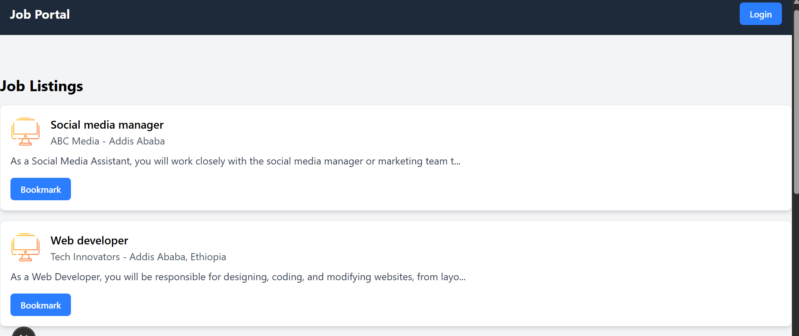
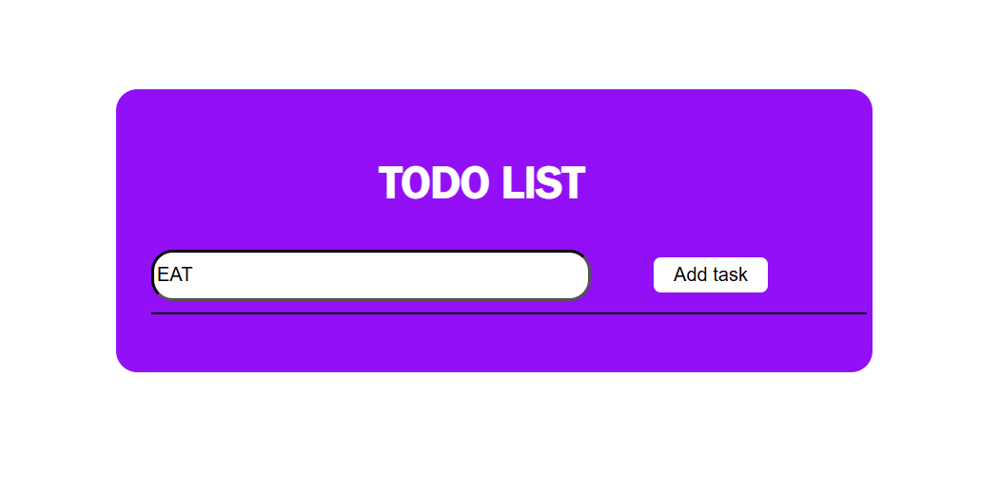
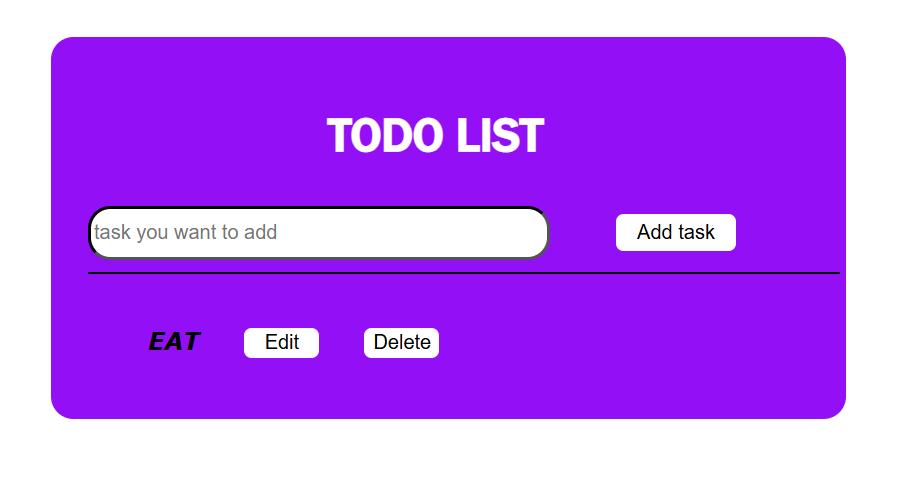
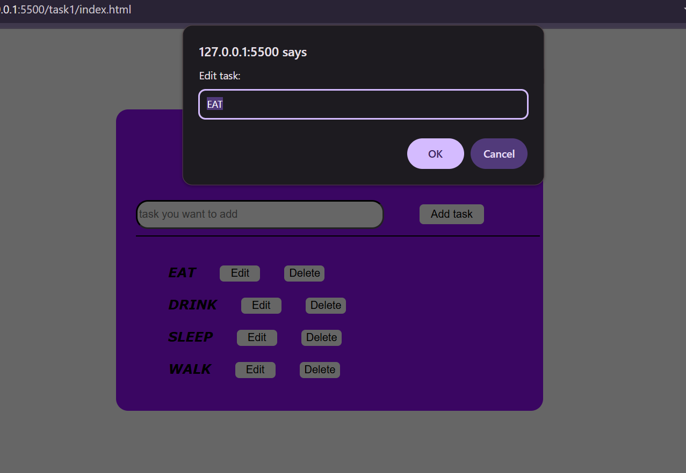
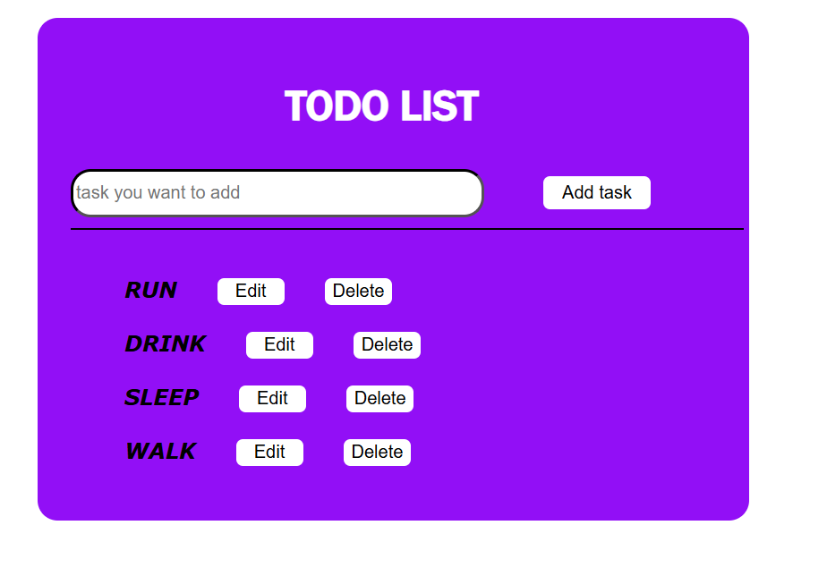
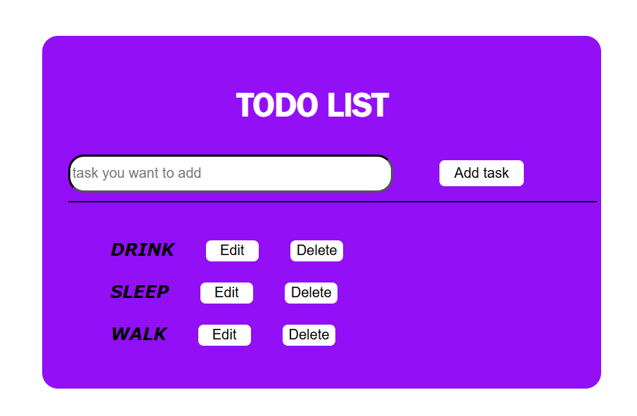

# Todo List App

## Description
This is a simple Todo List application built with HTML, CSS, and JavaScript. It allows users to add, edit, and delete tasks, providing a basic yet functional task management tool. The app is designed for educational purposes as part of the A2SV Web Development track.

## Features
- Add new tasks using an input field and button or Enter key.
- Edit existing tasks by clicking the "Edit" button.
- Delete tasks by clicking the "Delete" button.
- Basic styling for a clean user interface.

## How to Run
1. **Clone the Repository**:
   - Run `git clone https://github.com/Eden344/A2SV.git` in your terminal.
2. **Open the Project**:
   - Navigate to the project folder: `cd A2SV`.
   - Open `index.html` in a web browser (e.g., Chrome, Firefox).
3. **No Server Required**:
   - This is a static app; simply use the file system to view it.

## Screenshots
- **Home Page**:  
    
  _Description: The initial view with an input field and empty list._
- **Task Added**:  
   
     
  _Description: A task "Learn JavaScript" added to the list with edit and delete options._
- **Task Edited**:  
    
    
  _Description: The task edited to "Learn JavaScript and CSS"._
- **Task Deleted**:  
    
  _Description: The list after deleting a task._

## Technologies Used
- **HTML**: Structure of the app.
- **CSS**: Basic styling.
- **JavaScript**: Functionality for adding, editing, and deleting tasks.

## Author
- Eden (GitHub: @Eden344)

